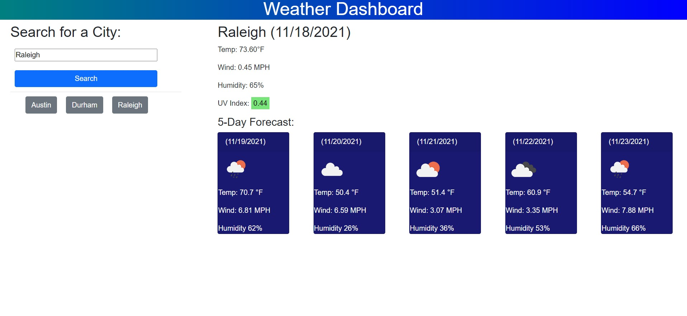

# Weather Dashboard
## Purpose 
 Weather Dashboard will allow users to input a city name. The city name will then be used to display several weather conditions in a main display element, while 5-day forecast information will be displayed below it. The user's past searches will also remain accessible via generated buttons that reflect their past inputs. Clicking these buttons will allow the user to switch back to data for a previously entered city. 
 
 ## Languages Used
 - Javascript
 - HTML
 - CSS

### Depooyed Site
Site deployed at [Weather Dashboard](https://aucoats.github.io/weatherdash-challenge)

